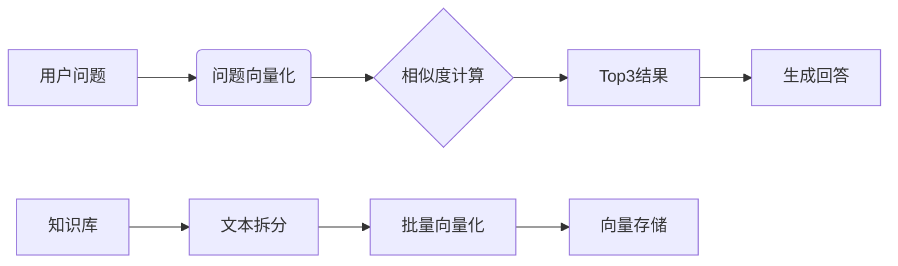

# RAG知识库系统（Python实现版）

📚 一个基于检索增强生成（RAG）的个人知识库系统最简Demo，适合初学者学习AI应用开发

> 现在通过本链接点击注册[硅基流动](https://cloud.siliconflow.cn/i/g8snVG3G)即可获得 2000万 Tokens，折合人民币14元！
>
> 受邀好友作为新用户完成 SiliconCloud 账号注册，立刻获得 2000万 Tokens。
>
> 链接：[https://cloud.siliconflow.cn/i/g8snVG3G](https://cloud.siliconflow.cn/i/g8snVG3G)

> **更新于2025.2.19,所有内容基于 `Commit:完善注释`版本书写。**

---

## 其他内容

- [RAG系统运行流程详解（以&#34;请介绍下刘芳&#34;为例）](docs/Flow.md)

## 🌟 功能特性

- 自动文本向量化：将知识库内容转换为AI可理解的数字形式
- 智能检索：通过语义相似度匹配最相关知识
- 对话生成：基于大模型生成自然语言回答
- 持久化存储：自动保存向量数据，减少重复计算
- 完整日志：记录系统运行的每个步骤

## 🎯 工作原理



## 🚀 快速开始

### 环境准备

1. Python 3.8+
2. 申请API密钥（[硅基流动](https://cloud.siliconflow.cn/i/g8snVG3G)）

### 安装依赖

```bash
pip install numpy requests python-dotenv
```

### 配置设置

复制配置文件

```bash
cp config_template.json config.json
```

填写获得的API密钥

### 运行示例

```bash
python index.py
```

## 📂 代码结构

```
.
├── logger.py          # 日志系统（自动记录运行细节）
├── kb.py              # 知识库处理（向量化/检索）
├── rag.py             # RAG核心逻辑
├── api.py             # 大模型API交互
├── index.py           # 示例调用
├── config.json        # 配置文件
└── 私人知识库.txt       # 示例知识库
```

## ⚙️ 配置说明（config.json）

```json
{
  "api": {
    "key": "your_api_key",  // 必填
    "base_url": "https://api.siliconflow.cn/v1"
  },
  "models": {
    "embedding": "Pro/BAAI/bge-m3",      // 向量生成模型
    "chat": "Qwen/Qwen2.5-72B-Instruct-128K"  // 对话模型
  },
  "retrieval": {
    "top_k": 3  // 返回最相似结果数
  }
}
```

## 📖 运行示例

### 问题：请介绍下刘芳

```python
# index.py
msg = rag.chat('请介绍下刘芳')
```

### 系统输出

```
问题1：请介绍下刘芳
回答：刘芳是MIS部门的成员，性别女，来自广东深圳。她的联系电话是13711223344，爱好包括瑜伽和绘画。
```

### 运行过程解析

1. 首次运行自动向量化知识库（约30秒）
2. 将问题转换为768维向量
3. 计算与所有文本块的余弦相似度
4. 选择最相似的3个结果（刘芳、韩雪、孙婷婷）
5. 组合上下文生成最终回答

## ❓ 常见问题

### Q：如何获取API密钥？

A：访问[硅基流动平台](https://cloud.siliconflow.cn/i/g8snVG3G)注册后申请

### Q：知识库支持多大文件？

A：建议不超过1MB，过大文件需调整拆分逻辑

### Q：`top_k`参数的作用？

A：控制返回的相关结果数量，数值越大上下文越丰富但响应越慢

## 🤝 参与贡献

欢迎提交Issue或PR：

1. Fork项目
2. 创建特性分支（git checkout -b feature/xxx）
3. 提交修改（git commit -m '添加新功能'）
4. 推送分支（git push origin feature/xxx）
5. 新建Pull Request

> 💡 提示：运行前请确保已正确配置API密钥，首次运行会进行向量化处理需要较长时间（约1-2分钟）

---

## 参考

> https://blog.csdn.net/yixiao0307/article/details/145387466

## 📜 许可证

MIT License
