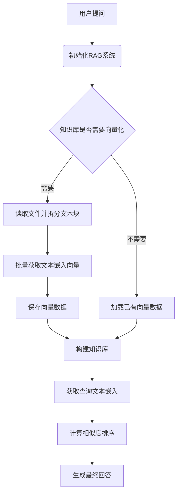

# RAG知识库系统（Python实现版）

📚 一个基于检索增强生成（RAG）的个人知识库系统最简Demo，适合初学者学习AI应用开发

> 现在通过本链接点击注册[硅基流动](https://cloud.siliconflow.cn/i/g8snVG3G)即可获得 2000万 Tokens，折合人民币14元！
>
> 受邀好友作为新用户完成 SiliconCloud 账号注册，立刻获得 2000万 Tokens。
>
> 链接：[https://cloud.siliconflow.cn/i/g8snVG3G](https://cloud.siliconflow.cn/i/g8snVG3G)

> **更新于2025.2.19,所有内容基于Commit:First版本书写。**

---


[TOC]


## 🌟 功能特性
- 自动文本向量化：将知识库内容转换为AI可理解的数字形式
- 智能检索：通过语义相似度匹配最相关知识
- 对话生成：基于大模型生成自然语言回答
- 持久化存储：自动保存向量数据，减少重复计算
- 完整日志：记录系统运行的每个步骤

## 🎯 工作原理


## 🚀 快速开始

### 环境准备
1. Python 3.8+
2. 申请API密钥（[硅基流动](https://cloud.siliconflow.cn/i/g8snVG3G)）

### 安装依赖
```bash
pip install numpy requests python-dotenv
```

### 配置设置
复制配置文件

```bash
cp config_template.json config.json
```
填写获得的API密钥

### 运行示例
```bash
python index.py
```

## 📂 代码结构
```
.
├── logger.py          # 日志系统（自动记录运行细节）
├── kb.py              # 知识库处理（向量化/检索）
├── rag.py             # RAG核心逻辑
├── api.py             # 大模型API交互
├── index.py           # 示例调用
├── config.json        # 配置文件
└── 私人知识库.txt       # 示例知识库
```

## ⚙️ 配置说明（config.json）
```json
{
  "api": {
    "key": "your_api_key",  // 必填
    "base_url": "https://api.siliconflow.cn/v1"
  },
  "models": {
    "embedding": "Pro/BAAI/bge-m3",      // 向量生成模型
    "chat": "Qwen/Qwen2.5-72B-Instruct-128K"  // 对话模型
  },
  "retrieval": {
    "top_k": 3  // 返回最相似结果数
  }
}
```

## 📖 运行示例
### 问题：请介绍下刘芳
```python
# index.py
msg = rag.chat('请介绍下刘芳')
```

### 系统输出
```
问题1：请介绍下刘芳
回答：刘芳是MIS部门的成员，性别女，来自广东深圳。她的联系电话是13711223344，爱好包括瑜伽和绘画。
```

### 运行过程解析
1. 首次运行自动向量化知识库（约30秒）
2. 将问题转换为768维向量
3. 计算与所有文本块的余弦相似度
4. 选择最相似的3个结果（刘芳、韩雪、孙婷婷）
5. 组合上下文生成最终回答

## ❓ 常见问题

### Q：如何获取API密钥？
A：访问[硅基流动平台](https://cloud.siliconflow.cn/i/g8snVG3G)注册后申请

### Q：知识库支持多大文件？
A：建议不超过1MB，过大文件需调整拆分逻辑

### Q：`top_k`参数的作用？
A：控制返回的相关结果数量，数值越大上下文越丰富但响应越慢

## 🤝 参与贡献
欢迎提交Issue或PR：
1. Fork项目
2. 创建特性分支（git checkout -b feature/xxx）
3. 提交修改（git commit -m '添加新功能'）
4. 推送分支（git push origin feature/xxx）
5. 新建Pull Request

> 💡 提示：运行前请确保已正确配置API密钥，首次运行会进行向量化处理需要较长时间（约1-2分钟）

---

## 参考

> https://blog.csdn.net/yixiao0307/article/details/145387466

## 📜 许可证
MIT License

---

# RAG系统运行流程详解（以"请介绍下刘芳"为例）

## 🌟 系统整体流程图示

## 一、初始化阶段（首次运行）

### 1. 创建日志系统
```python
# logger.py
# 创建logs目录并配置日志格式
logger = logging.getLogger('rag_system')
logger.addHandler(file_handler)  # 文件日志
logger.addHandler(console_handler)  # 控制台日志
```
🔍 **原理**：系统启动时首先创建日志记录器，用于跟踪后续所有操作。日志会同时保存到文件和控制台。

### 2. 知识库初始化
```python
# index.py
rag = Rag('私人知识库.txt')  # 触发Kb初始化
```
```python
# kb.py __init__()
if self.need_recompute():  # 检查最后修改时间
    content = self.read_file(filepath)  # 读取文本文件
    self.chunks = self.split_content(content)  # 按#分割文本块
    self.embeds = self.get_embeddings(self.chunks)  # 关键步骤❗
```

#### 日志证据：
```
2025-02-19 21:52:52,031 - 需要重新计算向量
2025-02-19 21:52:52,032 - 开始获取文本嵌入向量: MIS部门人员名单...
```

### 3. 文本向量化过程
```python
# api.py
def get_embedding(text):
    response = requests.post(f"{API_BASE}/embeddings", json={
        "model": "Pro/BAAI/bge-m3",
        "input": text
    })
    return response.json()["data"][0]["embedding"]
```
🔍 **原理**：将每个文本块通过BGE-M3模型转换为768维的向量（数字数组），用于后续相似度计算。

#### 示例文本块：
```
1. 刘芳
姓名：刘芳
性别：女
爱好：瑜伽、绘画
电话：13711223344
籍贯：广东深圳
```

#### 对应向量（简化示例）：
`[0.23, -0.45, 0.67, ..., 0.82]` （实际为768维浮点数数组）

### 4. 向量数据保存
```python
# kb.py save_embeddings()
np.save("embeddings/vectors.npy", self.embeds)  # 保存向量矩阵
with open("embeddings/chunks.txt", 'w') as f:  # 保存原始文本
    f.write('\n===\n'.join(self.chunks))
```
📁 生成文件：
- vectors.npy：所有文本块的向量矩阵（30x768）
- chunks.txt：原始文本块（用===分隔）
- last_modified.txt：知识库文件最后修改时间戳

---

## 二、处理用户查询阶段

### 1. 接收用户消息
```python
# index.py
msg = rag.chat('请介绍下刘芳')
```

### 2. 查询向量化
```python
# kb.py search()
ask_embed = get_embedding(text)  # 将问题转换为向量
```
🔍 **原理**：问题"请介绍下刘芳"被转换为同维度的向量，用于与知识库向量比较。

#### 日志证据：
```
2025-02-19 21:53:00,110 - 开始获取文本嵌入向量: 请介绍下刘芳...
2025-02-19 21:53:00,276 - 成功获取嵌入向量
```

### 3. 相似度计算
```python
# kb.py similarity()
dot_product = np.dot(A, B)  # 向量点积
cosine_sim = dot_product / (norm_A * norm_B)  # 余弦相似度
```

#### 计算示例：
| 文本块 | 相似度 |
| ------ | ------ |
| 刘芳   | 0.6185 |
| 韩雪   | 0.4328 |
| 孙婷婷 | 0.4305 |

### 4. 结果排序与筛选
```python
similarities.sort(key=lambda x: x[1], reverse=True)  # 降序排序
results = similarities[:3]  # 取top3
```

#### 日志证据：
```
Top 1 匹配结果: 相似度:0.6185（刘芳）
Top 2 匹配结果: 相似度:0.4328（韩雪）
Top 3 匹配结果: 相似度:0.4305（孙婷婷）
```

---

## 三、生成回答阶段

### 1. 构建提示词
```python
# rag.py
prompt = '请基于以下内容回答问题：\n' + context
```
实际拼接内容：
```
请基于以下内容回答问题：
1. 刘芳...（Top1结果）
2. 韩雪...（Top2结果）
3. 孙婷婷...（Top3结果）
```

### 2. 调用大模型生成
```python
# api.py
response = requests.post(f"{API_BASE}/chat/completions", json={
    "model": "Qwen/Qwen2.5-72B-Instruct-128K",
    "messages": [{
        "role": "system",
        "content": prompt
    },{
        "role": "user",
        "content": message
    }]
})
```

### 3. 返回最终结果
```python
return "刘芳是MIS部门的成员，性别女，来自广东深圳。她的联系电话是13711223344。刘芳的爱好包括瑜伽和绘画。"
```

---

## 四、关键问题解答

### Q：为什么要拆分文本块？
A：长文本直接向量化会丢失细节，拆分后可以精准匹配特定段落。根据日志，系统用`split('# ')`将知识库拆分为30个人员条目。

### Q：为什么需要计算余弦相似度？
A：通过比较向量夹角判断语义相似度（0-1值），比简单关键词匹配更理解语义。例如"介绍刘芳"能准确匹配到刘芳的条目，而不是包含"介绍"的其他条目。

### Q：top_k=3是怎么工作的？
A：在config.json中设置返回最相似的3个结果，平衡准确性与信息量。实际日志显示返回了刘芳、韩雪、孙婷婷三个结果。